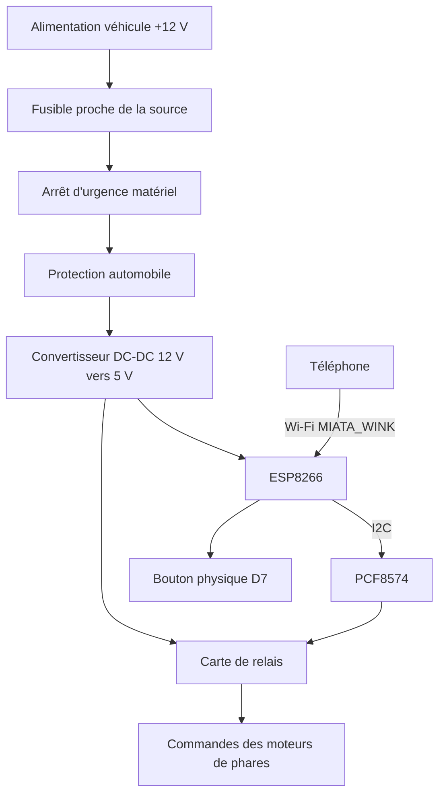

# MIATA_WINK — Contrôleur de phares pop-up pour Mazda MX-5 NA

Contrôleur Wi-Fi et physique pour les phares escamotables d'une Mazda MX-5 NA, basé sur un ESP8266 et un expandeur d'entrées/sorties PCF8574.

Le système permet :

- l'ouverture et la fermeture classique des deux phares ;
- la création d'animations expressives ;
- le contrôle indépendant de la hauteur estimée de chaque phare ;
- le pilotage depuis un téléphone, par Wi-Fi ;
- le pilotage depuis un bouton physique multifonction ;
- l'arrêt immédiat des relais depuis l'interface ;
- la coupure matérielle de l'alimentation du contrôleur au moyen d'un bouton d'arrêt d'urgence.

> [!WARNING]
> Ce projet intervient sur le circuit électrique d'un véhicule.
>
> Une erreur de câblage peut provoquer un court-circuit, un départ de feu, une détérioration du véhicule ou un mouvement involontaire des phares.
>
> Utilisez impérativement un fusible adapté, des conducteurs automobiles correctement dimensionnés, des connecteurs isolés et un convertisseur DC-DC conçu pour supporter les perturbations d'un réseau automobile.
>
> Les animations doivent être utilisées uniquement lorsque le véhicule est à l'arrêt et dans un environnement sécurisé. Elles peuvent ne pas être autorisées sur route ouverte.

---

## Sommaire

- [Présentation](#présentation)
- [Fonctionnalités](#fonctionnalités)
- [Principe de fonctionnement](#principe-de-fonctionnement)
- [Matériel nécessaire](#matériel-nécessaire)
- [Câblage](#câblage)
- [Arrêt d'urgence matériel](#arrêt-durgence-matériel)
- [Mapping des broches](#mapping-des-broches)
- [Installation du firmware](#installation-du-firmware)
- [Connexion à l'interface](#connexion-à-linterface)
- [Utilisation](#utilisation)
- [Réglage de hauteur](#réglage-de-hauteur)
- [Fonctionnement des moteurs de MX-5 NA](#fonctionnement-des-moteurs-de-mx-5-na)
- [Architecture logicielle](#architecture-logicielle)
- [Commandes HTTP](#commandes-http)
- [Sécurités logicielles](#sécurités-logicielles)
- [Limites connues](#limites-connues)
- [Calibration](#calibration)
- [Dépannage](#dépannage)
- [Améliorations prévues](#améliorations-prévues)
- [Licence](#licence)

---

## Présentation

`MIATA_WINK` est un contrôleur de phares escamotables destiné à une Mazda MX-5 NA.

Le contrôleur utilise un ESP8266 pour créer son propre point d'accès Wi-Fi et héberger une interface web locale. Un téléphone peut ainsi contrôler les phares sans application mobile et sans connexion Internet.

Les quatre commandes moteur sont pilotées par un PCF8574 connecté en I²C :

- montée du phare gauche ;
- descente du phare gauche ;
- montée du phare droit ;
- descente du phare droit.

Les relais utilisés sont actifs à l'état bas : une sortie `LOW` active le relais et une sortie `HIGH` le désactive.

Le système possède également un bouton physique multifonction monté dans l'habitacle.

---

## Fonctionnalités

### Commandes classiques

- ouverture complète des deux phares ;
- fermeture complète des deux phares ;
- arrêt immédiat des relais.

### Animations

- clin d'œil gauche ;
- clin d'œil droit ;
- regard mi-ouvert / `Sleepy` ;
- double clin d'œil gauche ;
- effet Ping-Pong ;
- effet Curieux ;
- vague simple ;
- vague continue.

### Contrôle individuel

- réglage du phare gauche de 0 à 100 % ;
- réglage du phare droit de 0 à 100 % ;
- déclenchement uniquement après validation avec le bouton `OK` ;
- aucune commande moteur pendant le simple déplacement du slider.

### Contrôle physique

| Action sur le bouton | Fonction |
|---|---|
| 1 clic | Ouvre ou ferme les deux phares |
| 2 clics | Clin d'œil gauche |
| Maintien 2 secondes | Animation Ping-Pong |
| Maintien 4 secondes | Descente de sécurité des deux phares |

### Arrêt d'urgence

Un bouton d'arrêt d'urgence matériel coupe le +12 V alimentant le contrôleur, avant le convertisseur DC-DC.

Cet arrêt est indépendant :

- du firmware ;
- de l'ESP8266 ;
- du serveur web ;
- du réseau Wi-Fi ;
- du PCF8574.

---

## Principe de fonctionnement



L'ESP8266 crée le réseau Wi-Fi suivant :

```text
SSID : MIATA_WINK
Mot de passe : 123456789
```

Une fois le téléphone connecté, le portail captif tente d'ouvrir automatiquement l'interface. Si ce n'est pas le cas, l'adresse suivante peut être ouverte manuellement :

```text
http://192.168.4.1/
```

---

## Matériel nécessaire

| Quantité | Composant | Rôle |
|---:|---|---|
| 1 | ESP8266 NodeMCU ou Wemos D1 mini | Microcontrôleur, Wi-Fi et serveur web |
| 1 | PCF8574 | Expandeur I²C 8 bits |
| 4 | Relais actifs à LOW | Commandes montée/descente gauche/droite |
| 1 | Bouton poussoir momentané | Commande physique multifonction |
| 1 | Arrêt d'urgence à verrouillage mécanique | Coupure matérielle de l'alimentation |
| 1 | Convertisseur DC-DC automobile 12 V → 5 V | Alimentation du contrôleur |
| 1 | Fusible et porte-fusible | Protection de l'alimentation |
| 1 | Protection contre inversion de polarité | Protection de l'électronique |
| 1 | Protection contre les surtensions transitoires | Protection adaptée au réseau automobile |
| — | Câbles et connecteurs automobiles | Raccordement |
| — | Boîtier isolant | Protection mécanique du montage |

### Matériel retiré

Les versions initiales du projet comportaient deux bandeaux WS2812B et des relais d'alimentation pour un éclairage d'ambiance.

Ces éléments ont été retirés physiquement et ne font plus partie du firmware.

---

## Câblage

### ESP8266

| Fonction | Broche ESP8266 |
|---|---|
| SDA I²C | `D2` |
| SCL I²C | `D1` |
| Bouton physique | `D7` |
| Masse | `GND` |
| Alimentation | Selon la carte utilisée |

Le bouton physique est câblé entre `D7` et `GND`.

Le firmware configure cette broche avec :

```cpp
pinMode(buttonPin, INPUT_PULLUP);
```

L'état du bouton est donc :

- `HIGH` au repos ;
- `LOW` lorsqu'il est pressé.

### PCF8574

Adresse I²C par défaut :

```cpp
#define PCF8574_ADDR 0x20
```

Cette adresse dépend de l'état des broches ou cavaliers `A0`, `A1` et `A2`.

| Port PCF8574 | Fonction |
|---|---|
| `P0` | Relais de montée du phare gauche |
| `P1` | Relais de descente du phare gauche |
| `P2` | Relais de montée du phare droit |
| `P3` | Relais de descente du phare droit |
| `P4` | Libre |
| `P5` | Libre |
| `P6` | Libre |
| `P7` | Libre |

### Logique des relais

Les relais sont actifs à l'état bas :

```cpp
#define RELAY_ON  LOW
#define RELAY_OFF HIGH
```

| Sortie PCF8574 | État du relais |
|---|---|
| `LOW` | Relais actif |
| `HIGH` | Relais inactif |

Au démarrage, l'octet du PCF8574 est initialisé à :

```cpp
uint8_t pcfState = 0xFF;
```

Les huit sorties sont donc placées à `HIGH`, ce qui correspond à tous les relais désactivés.

---

## Arrêt d'urgence matériel

L'arrêt d'urgence ne doit pas être un simple bouton connecté à une broche de l'ESP8266.

Il doit couper physiquement l'alimentation +12 V du contrôleur.

### Câblage de principe

```text
+12 V véhicule
      |
      +--- Fusible placé près de la source
      |
      +--- Contact normalement fermé de l'arrêt d'urgence
      |
      +--- Protection inversion/surtension
      |
      +--- Convertisseur DC-DC 12 V vers 5 V
      |
      +--- ESP8266 + PCF8574 + alimentation des relais
```

Le contact normalement fermé permet le fonctionnement normal du contrôleur tant que l'arrêt d'urgence n'est pas enclenché.

Lorsque le bouton est pressé :

1. le contact s'ouvre ;
2. le convertisseur DC-DC n'est plus alimenté ;
3. l'ESP8266 s'éteint ;
4. le PCF8574 s'éteint ;
5. les bobines des relais doivent être désalimentées ;
6. les contacts des relais doivent revenir dans leur position de repos ;
7. les commandes de mouvement des phares sont supprimées.

### Type de bouton recommandé

Utiliser de préférence :

- un bouton coup-de-poing ;
- à verrouillage mécanique ;
- à contact normalement fermé, `NC` ;
- avec déverrouillage par rotation ;
- prévu pour du courant continu ;
- avec un calibre compatible avec le courant réellement coupé.

### Utilisation d'un relais ou contacteur principal

Si le bouton d'arrêt d'urgence n'est pas capable de couper directement le courant du contrôleur, il doit commander un relais ou un contacteur principal :

```text
Circuit de commande :

+12 V après fusible
      |
      +--- Arrêt d'urgence NC
      |
      +--- Bobine du relais principal
      |
     GND


Circuit de puissance :

+12 V après fusible
      |
      +--- Contact du relais principal
      |
      +--- Convertisseur DC-DC
```

Le système doit être conçu de manière à ce qu'une coupure du circuit de commande désactive le relais principal.

### Point essentiel

La coupure doit désalimenter au minimum :

- la carte de relais ;
- les bobines des relais ;
- le PCF8574.

Si les relais disposent d'une alimentation séparée, par exemple avec une entrée `JD-VCC`, celle-ci doit également être prise en compte. Couper uniquement l'ESP8266 ne garantit pas nécessairement que les relais seront immédiatement désactivés.

### Redémarrage après arrêt d'urgence

Après déverrouillage du bouton :

1. le contrôleur redémarre ;
2. le PCF8574 est initialisé avec toutes ses sorties à l'état inactif ;
3. aucun mouvement ne doit être lancé automatiquement ;
4. l'utilisateur doit envoyer une nouvelle commande.

---

## Mapping des broches

### ESP8266

```cpp
#define I2C_SDA   D2
#define I2C_SCL   D1
#define buttonPin D7
```

### PCF8574

```cpp
#define PCF_LEFTUP     0
#define PCF_LEFTDOWN   1
#define PCF_RIGHTUP    2
#define PCF_RIGHTDOWN  3
```

---

## Attention aux niveaux logiques I²C

L'ESP8266 fonctionne en logique 3,3 V.

Certaines cartes PCF8574 alimentées en 5 V possèdent des résistances de rappel I²C connectées au 5 V. Dans ce cas, les lignes SDA et SCL peuvent présenter un niveau trop élevé pour l'ESP8266.

Avant la mise sous tension, vérifier :

- la tension des résistances de rappel SDA/SCL ;
- le schéma du module PCF8574 ;
- la compatibilité du module avec une logique 3,3 V.

Solutions possibles :

- alimenter le PCF8574 en 3,3 V si le matériel le permet ;
- tirer SDA et SCL vers 3,3 V ;
- retirer ou modifier les résistances de rappel du module ;
- utiliser un convertisseur de niveau I²C bidirectionnel.

Ne pas supposer qu'un module I²C alimenté en 5 V est automatiquement compatible avec l'ESP8266.

---

## Installation du firmware

### Prérequis

Installer :

- Arduino IDE ;
- le support des cartes ESP8266 ;
- un pilote USB adapté à la carte ;
- un câble USB permettant le transfert de données.

Les bibliothèques suivantes sont utilisées :

```cpp
#include <ESP8266WiFi.h>
#include <ESP8266WebServer.h>
#include <DNSServer.h>
#include <Wire.h>
```

Elles sont normalement fournies par le paquet ESP8266 pour Arduino.

### Installation du support ESP8266

Dans Arduino IDE :

1. ouvrir les préférences ;
2. ajouter l'URL du gestionnaire de cartes ESP8266 ;
3. ouvrir le gestionnaire de cartes ;
4. installer le paquet `esp8266 by ESP8266 Community` ;
5. sélectionner la carte correspondant au module utilisé.

Exemples :

- `NodeMCU 1.0 (ESP-12E Module)` ;
- `LOLIN(WEMOS) D1 R2 & mini`.

### Téléversement

1. ouvrir :

```text
firmware/miata_popup_controller/miata_popup_controller.ino
```

2. vérifier le SSID et le mot de passe :

```cpp
const char* mySSID = "MIATA_WINK";
const char* mySecKey = "123456789";
```

3. vérifier l'adresse du PCF8574 :

```cpp
#define PCF8574_ADDR 0x20
```

4. sélectionner la carte et le port série ;
5. compiler ;
6. téléverser ;
7. ouvrir le moniteur série à `115200` bauds si nécessaire.

---

## Connexion à l'interface

1. mettre le contrôleur sous tension ;
2. rechercher les réseaux Wi-Fi disponibles ;
3. sélectionner :

```text
MIATA_WINK
```

4. saisir le mot de passe :

```text
123456789
```

5. attendre l'ouverture du portail captif.

Si le portail ne s'ouvre pas automatiquement, accéder à :

```text
http://192.168.4.1/
```

L'interface est entièrement hébergée par l'ESP8266.

Aucune application mobile n'est requise.

---

## Utilisation

### Interface web

| Commande | Effet |
|---|---|
| `Up` | Ouvre complètement les deux phares |
| `Down` | Ferme complètement les deux phares |
| `Wink L.` | Clin d'œil gauche |
| `Wink R.` | Clin d'œil droit |
| `Sleepy` | Position partiellement ouverte |
| `D-Wink` | Double clin d'œil gauche |
| `Ping-Pong` | Mouvement croisé gauche/droite |
| `Curieux` | Séquence gauche, droite, ouverture, fermeture |
| `Vague` | Vague simple |
| `Continue` | Vague répétée jusqu'à l'arrêt |
| `System Stop` | Coupe immédiatement toutes les commandes de relais |

## 🎬 Démonstration

<p align="center">
  <a href="https://www.instagram.com/reel/DbiLK4aoaiP/">
    
  </a>
</p>

<p align="center">
  <strong>
    <a href="https://www.instagram.com/reel/DbiLK4aoaiP/">
      ▶ Voir la vidéo sur Instagram
    </a>
  </strong>
</p>


### Différence entre `System Stop` et l'arrêt d'urgence

#### `System Stop`

- commande logicielle ;
- nécessite que l'ESP8266 fonctionne ;
- nécessite que l'interface soit accessible ;
- place les relais à l'état inactif ;
- ne coupe pas physiquement l'alimentation.

#### Arrêt d'urgence

- commande matérielle ;
- ne dépend pas du logiciel ;
- coupe le +12 V avant le convertisseur DC-DC ;
- arrête le contrôleur et désalimente les relais ;
- doit être utilisé en cas de comportement anormal.

---

## Bouton physique

Le bouton physique est connecté sur `D7` et utilise la résistance de rappel interne de l'ESP8266.

| Action | Effet |
|---|---|
| 1 clic | Bascule entre ouverture et fermeture |
| 2 clics | Lance un clin d'œil gauche |
| Maintien 2 s | Lance l'effet Ping-Pong |
| Maintien 4 s | Lance une descente complète de sécurité |

Le firmware utilise :

- un délai d'anti-rebond ;
- une fenêtre de double-clic ;
- un seuil de maintien à 2 secondes ;
- un seuil de maintien long à 4 secondes.

> [!NOTE]
> Dans l'implémentation actuelle, un maintien de 4 secondes déclenche d'abord le Ping-Pong à 2 secondes, puis remplace cette animation par la descente de sécurité à 4 secondes.

L'arrêt d'urgence matériel reste indépendant de ce bouton multifonction.

---

## Réglage de hauteur

L'interface comporte deux sliders verticaux :

- un pour le phare gauche ;
- un pour le phare droit.

Chaque slider sélectionne une cible entre :

```text
0 %   = phare abaissé
100 % = phare levé
```

Le déplacement du slider ne déclenche aucune commande.

Le mouvement est envoyé uniquement lorsque le bouton `OK` correspondant est pressé. Cela évite d'activer les moteurs à chaque variation du slider.

### Calcul du temps de mouvement

La durée d'une course complète est configurée avec :

```cpp
#define FULL_TRAVEL_MS 750UL
```

Le temps de commande est calculé proportionnellement à l'écart demandé :

```text
durée = |cible - position estimée| × FULL_TRAVEL_MS / 100
```

Exemple :

```text
Position estimée : 20 %
Nouvelle cible   : 80 %
Écart            : 60 %
Durée            : 60 × 750 / 100
Durée            : 450 ms
```

---

## Fonctionnement des moteurs de MX-5 NA

Les moteurs de phares de la Mazda MX-5 NA disposent d'un système interne de fin de course.

Lorsqu'un phare atteint sa position mécanique complètement ouverte ou complètement fermée, le moteur interrompt automatiquement son mouvement.

Le firmware n'a donc pas besoin d'analyser continuellement une hauteur réelle ni d'ajouter un capteur externe pour les commandes complètes `Up` et `Down`.

Cela permet également de resynchroniser mécaniquement les phares :

- une commande `Up` suffisamment longue place les phares en butée haute ;
- une commande `Down` suffisamment longue place les phares en butée basse ;
- les moteurs s'arrêtent grâce à leur système interne de fin de course.

Le firmware conserve toutefois une temporisation maximale afin de ne pas laisser inutilement un relais actif.

### Important

Le système interne de fin de course ne fournit pas à l'ESP8266 une valeur de position comprise entre 0 et 100 %.

Le réglage intermédiaire reste donc une estimation en boucle ouverte fondée sur la durée d'activation du moteur.

Les fins de course internes permettent de fiabiliser les positions extrêmes, mais pas de connaître précisément une position intermédiaire.

---

## Architecture logicielle

Le programme utilise une architecture non bloquante.

Aucun `delay()` n'est utilisé dans la boucle principale pour gérer les mouvements ou les animations.

La boucle principale continue à traiter :

- le serveur DNS ;
- le serveur HTTP ;
- la machine d'animation ;
- les déplacements manuels ;
- le bouton physique.

### Boucle principale

```cpp
void loop() {
  dnsServer.processNextRequest();
  myWeb.handleClient();

  updateSequence();
  updateManualHeadlights();

  int b = checkButton();

  // Traitement des événements du bouton
}
```

### Machine d'animation

Le type d'animation actif est stocké dans :

```cpp
AnimType currentAnim;
```

Les principales variables d'état sont :

```cpp
int seqStep;
unsigned long seqTimer;
bool seqContinuous;
```

Chaque animation est divisée en étapes temporisées.

La fonction :

```cpp
updateSequence();
```

est appelée continuellement par `loop()` et fait progresser l'animation lorsque le temps prévu est écoulé.

### Contrôle individuel

Les mouvements manuels utilisent :

```cpp
bool leftMoving;
bool rightMoving;
unsigned long leftMoveEnd;
unsigned long rightMoveEnd;
```

La fonction :

```cpp
updateManualHeadlights();
```

désactive les relais lorsqu'un mouvement temporisé est terminé.

### Communication PCF8574

Le PCF8574 ne possède pas de registre de sortie adressable bit par bit.

Le firmware conserve donc une copie locale de l'octet de sortie :

```cpp
uint8_t pcfState = 0xFF;
```

La fonction :

```cpp
pcfWrite(pin, value);
```

modifie le bit demandé puis retransmet l'octet complet sur le bus I²C.

---

## Commandes HTTP

Dans la version actuelle, les commandes sont envoyées sous forme de paramètres HTTP sur la route principale.

### Animations

```text
/?cmd=Up
/?cmd=Down
/?cmd=WinkG
/?cmd=WinkD
/?cmd=Sleepy
/?cmd=DWink
/?cmd=PingPong
/?cmd=Curious
/?cmd=Wave
/?cmd=WaveCont
/?cmd=Stop
```

### Hauteur gauche

```text
/?heightL=50
```

### Hauteur droite

```text
/?heightR=50
```

Les valeurs de hauteur sont limitées entre 0 et 100 par le firmware.

---

## Sécurités logicielles

Le firmware applique plusieurs règles :

1. tous les relais sont configurés comme inactifs au démarrage ;
2. une nouvelle animation arrête les mouvements précédents ;
3. un réglage individuel annule l'animation globale ;
4. les commandes de relais sont limitées dans le temps ;
5. `System Stop` coupe immédiatement les sorties de commande ;
6. les commandes `Up` et `Down` resynchronisent les estimations ;
7. une seule animation globale est exécutée à la fois.

### Sécurité matérielle

Le logiciel ne doit jamais être considéré comme l'unique dispositif de sécurité.

Le système doit également comporter :

- un fusible ;
- un arrêt d'urgence matériel ;
- une protection contre les inversions de polarité ;
- une protection contre les transitoires automobiles ;
- des relais adaptés ;
- un câblage correctement dimensionné ;
- une masse commune fiable ;
- un boîtier isolé ;
- si possible, un interverrouillage électrique empêchant l'activation simultanée de la montée et de la descente d'un même phare.

---

## Limites connues

### Pas de retour de position intermédiaire

Les fins de course internes indiquent mécaniquement les positions extrêmes, mais aucune position intermédiaire n'est transmise à l'ESP8266.

Les valeurs suivantes sont donc des estimations :

```cpp
leftHeight
rightHeight
```

### Dérive possible

La position estimée peut dériver en fonction :

- de la tension de la batterie ;
- du temps de réponse des relais ;
- des frottements mécaniques ;
- de la température ;
- de l'usure des moteurs ;
- d'une interruption manuelle ;
- d'un redémarrage pendant un mouvement.

Une commande complète `Up` ou `Down` permet de revenir sur une position mécanique connue.

### Une seule animation globale

Une nouvelle commande remplace le mouvement précédent.

Ce comportement est volontaire afin de réduire le risque de conserver un relais actif.

### État perdu après coupure

Les estimations de hauteur sont stockées uniquement en mémoire vive.

Après une coupure d'alimentation, le firmware repart avec les valeurs initiales.

Il est recommandé d'exécuter une commande complète `Up` ou `Down` après un redémarrage si la position réelle n'est pas connue.

### Mot de passe dans le firmware

Le mot de passe du point d'accès est stocké en clair dans le code source :

```cpp
const char* mySecKey = "123456789";
```

Il doit être modifié avant une installation définitive.

### Portail captif

L'ouverture automatique dépend du téléphone et de son système d'exploitation. Elle n'est pas garantie.

L'interface reste accessible à l'adresse :

```text
http://192.168.4.1/
```

### Police web externe

L'interface utilise actuellement une police Google Fonts.

Comme le point d'accès ne fournit généralement pas Internet, cette police peut ne pas être téléchargée. Le navigateur utilisera alors une police de remplacement.

Une future version pourra supprimer cette dépendance externe.

---

## Calibration

La valeur par défaut est :

```cpp
#define FULL_TRAVEL_MS 750UL
```

Cette valeur doit être vérifiée sur le véhicule.

### Procédure

1. placer le véhicule à l'arrêt ;
2. sécuriser la zone autour des phares ;
3. vérifier le bon fonctionnement de l'arrêt d'urgence ;
4. envoyer une commande complète de descente ;
5. mesurer le temps nécessaire pour une montée complète ;
6. répéter la mesure plusieurs fois ;
7. choisir une valeur suffisamment longue pour atteindre la butée ;
8. conserver une marge raisonnable ;
9. vérifier que les fins de course internes arrêtent correctement les moteurs ;
10. tester séparément le phare gauche et le phare droit.

Exemple :

```cpp
#define FULL_TRAVEL_MS 800UL
```

Une durée trop courte peut empêcher une resynchronisation complète.

Une durée beaucoup trop longue maintient inutilement le relais commandé, même si le moteur s'est arrêté sur son fin de course interne.

---

## Dépannage

### L'ESP8266 ne crée pas le réseau Wi-Fi

Vérifier :

- l'alimentation 5 V ;
- le câble USB ;
- le convertisseur DC-DC ;
- le câblage de l'arrêt d'urgence ;
- le moniteur série à 115200 bauds ;
- le type de carte sélectionné dans Arduino IDE.

### L'interface ne s'ouvre pas automatiquement

Ouvrir manuellement :

```text
http://192.168.4.1/
```

Désactiver temporairement les données mobiles si le téléphone refuse d'utiliser un réseau Wi-Fi sans accès Internet.

### Aucun relais ne fonctionne

Vérifier :

- l'adresse du PCF8574 ;
- SDA sur `D2` ;
- SCL sur `D1` ;
- la masse commune ;
- l'alimentation de la carte de relais ;
- la logique active à LOW ;
- les éventuels cavaliers `JD-VCC` ;
- les résistances de rappel I²C.

### Les mauvais relais sont activés

Vérifier le mapping :

```cpp
#define PCF_LEFTUP     0
#define PCF_LEFTDOWN   1
#define PCF_RIGHTUP    2
#define PCF_RIGHTDOWN  3
```

Le marquage des borniers d'une carte de relais peut ne pas correspondre directement aux numéros `P0` à `P3`.

### Le PCF8574 n'est pas détecté

L'adresse peut être comprise entre :

```text
0x20 et 0x27
```

selon les cavaliers `A0`, `A1` et `A2`.

Utiliser un scanner I²C pour identifier l'adresse réelle.

### Les phares ne sont plus synchronisés

Effectuer une commande complète :

```text
Down
```

puis éventuellement :

```text
Up
```

Les systèmes internes de fin de course permettent aux moteurs de s'arrêter aux positions extrêmes.

### Les relais restent actifs après `System Stop`

Couper immédiatement l'alimentation avec l'arrêt d'urgence matériel.

Ne pas remettre le système sous tension avant d'avoir vérifié :

- le câblage ;
- le module de relais ;
- l'état du PCF8574 ;
- l'alimentation `JD-VCC` éventuelle ;
- la logique active LOW ;
- les contacts des relais.

---

## Recommandations d'installation automobile

L'alimentation électrique d'un véhicule n'est pas une source 12 V parfaitement stable.

Elle peut subir :

- des chutes de tension au démarrage ;
- des inversions accidentelles ;
- des parasites produits par les charges inductives ;
- des surtensions ;
- des transitoires importants.

Le montage définitif doit donc utiliser un étage d'alimentation automobile adapté.

### Chaîne d'alimentation recommandée

```text
+12 V véhicule
    |
    +-- Fusible proche de la prise d'alimentation
    |
    +-- Arrêt d'urgence normalement fermé
    |
    +-- Protection inversion de polarité
    |
    +-- Protection contre les surtensions
    |
    +-- Filtrage
    |
    +-- Convertisseur DC-DC automobile 12 V vers 5 V
    |
    +-- Contrôleur
```

Ne pas alimenter directement l'ESP8266 depuis le réseau 12 V du véhicule.

---

## Améliorations prévues

- [ ] séparer la page HTML des endpoints de commande ;
- [ ] retourner des réponses JSON légères ;
- [ ] ajouter un endpoint `/status` ;
- [ ] afficher l'animation en cours ;
- [ ] synchroniser les sliders avec l'état estimé ;
- [ ] réduire les transactions I²C inutiles ;
- [ ] ajouter un interverrouillage logiciel montée/descente ;
- [ ] gérer le débordement de `millis()` ;
- [ ] enregistrer la configuration dans la mémoire flash ;
- [ ] rendre le SSID et le mot de passe configurables ;
- [ ] intégrer une page de diagnostic I²C ;
- [ ] supprimer la dépendance à Google Fonts ;
- [ ] ajouter des schémas électriques ;
- [ ] ajouter des photos de l'installation ;
- [ ] proposer une version PlatformIO ;
- [ ] améliorer la gestion des appuis longs ;
- [ ] distinguer clairement arrêt normal et arrêt d'urgence.

---

## État du projet

Ce projet est expérimental et fourni sans garantie.

Il ne s'agit pas d'un produit automobile homologué.

L'auteur et les contributeurs ne peuvent pas garantir la compatibilité avec toutes les versions de Mazda MX-5 NA, tous les modules de relais ou toutes les modifications électriques antérieures du véhicule.

---

## Contribution

Les contributions sont les bienvenues.

Avant de proposer une modification :

1. créer une branche dédiée ;
2. documenter le matériel utilisé ;
3. expliquer le comportement avant et après modification ;
4. vérifier qu'aucun relais ne reste actif en cas d'interruption ;
5. tester l'arrêt d'urgence ;
6. ne pas introduire de temporisation bloquante dans la boucle principale.

---

## Licence

Le firmware et la documentation peuvent être publiés sous licence MIT.

Voir le fichier [`LICENSE`](LICENSE).

---

## Remerciements

Projet conçu pour les amateurs de Mazda MX-5 NA et de phares escamotables.

`MIATA_WINK` n'est pas affilié à Mazda Motor Corporation.

```markdown
## Référence de câblage

Le principe de câblage des relais sur le circuit des phares est basé sur le guide :

- [Popup headlight wink with Arduino and relay board — Instructables](https://www.instructables.com/Popup-headlight-wink-with-arduino-and-relay-board-/)

Pour afficher les détails ajoutés aux illustrations, cliquez sur une photo afin de l’agrandir, puis sélectionnez **View Notes** ou **Voir les notes** en haut de l’image.

> Le contrôleur présenté dans ce dépôt utilise un ESP8266 et un PCF8574. Le mapping des broches diffère donc de celui du montage d’origine.

Mazda, MX-5 et Miata sont des marques appartenant à leurs propriétaires respectifs.
